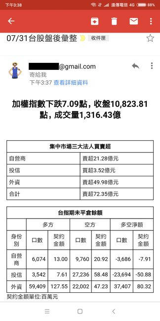

## InvestInfo
該程式是利用爬蟲技術(requests,pandas)，爬取當日股市、期市盤後公開資訊後，將結果發送至指定信箱。欲觀察市場動態，可將該批次檔加入電腦排程定時爬取相關資訊，彙整後，寄信通知相關人員。

## 盤後資訊寄至信箱



## 使用
```shell
先設定json/config.json，將相關參數設定好，再直接執行即可

  python.exe InvestInfo.py

※ 注意：股市收盤13:30
三大法人買賣資訊是14:45公布
期貨外資留單狀況是15:00公布
故執行時間必需在股期非假日15:10之後才會有完整資料
```
## json/config.json設定檔說明 
```
urlSMTP :  SMTP伺服器設定 資料型態string ex:smtp.gmail.com:587
passwd :  信箱密碼 資料型態string
mail_from :  寄件者信箱 資料型態string ex:john123@gmail.com
receivers : 收件人信箱，可設定多個，資料型態list  ex:["judy003@gmail.com","vivi004@gmail.com"]

```